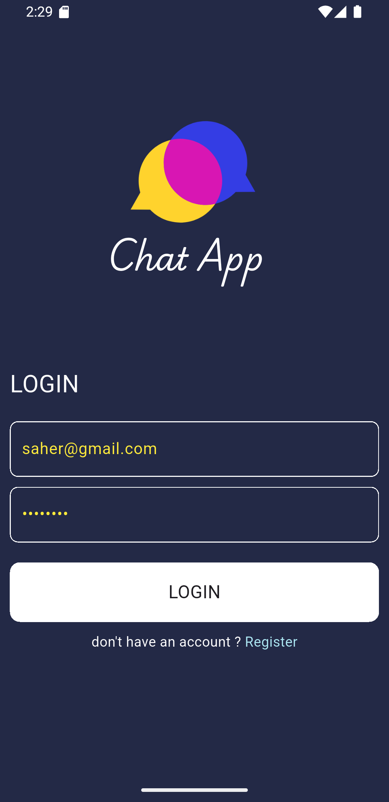
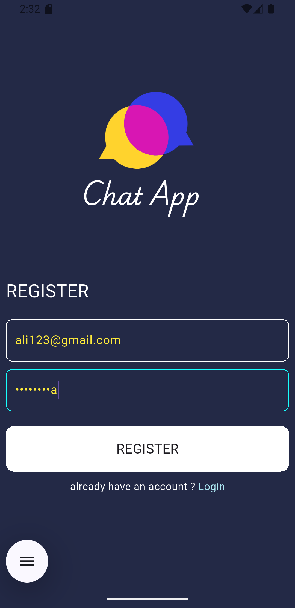
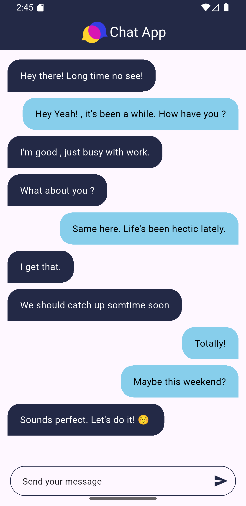

# 💬 Chat App - Flutter

A sleek and responsive chat application built with **Flutter** and **Firebase**. The app allows users to register, log in, and exchange real-time messages using Firebase Authentication and Cloud Firestore.

---


## 🚀 Features

- 🔐 Register and login securely with **Firebase Authentication**  
- 💬 Real-time messaging using **Cloud Firestore**  
- 🎯 Simple, responsive, and modern UI design  
- 📡 Seamless integration with **Firebase** backend  
- ⚙️ Easy to extend and customize  

---

## 📸 App Screenshots

<p align="center">
  
  
  
</p>

---

## 🛠️ Technologies Used

- **Flutter** 🐦  
- **Dart**  
- **Firebase Authentication**  
- **Cloud Firestore**  
- **ModalProgressHUD** for loading overlays  

---


## 📂 Project Structure

```
lib/
├── models/           # Data models (e.g. Message model)
├── pages/            # Screens: login, register, chat
├── widgets/          # Custom widgets like chat bubbles
├── constants.dart    # Reusable constants
├── main.dart         # App entry point
```

---

## 📝 How to Use

1. **Clone the repo**:
   ```bash
   git clone https://github.com/sahiralzakaria/Flutter-Learning-Apps-ChatApp.git
   cd Flutter-Learning-Apps-ChatApp
   ```

2. **Install dependencies**:
   ```bash
   flutter pub get
   ```

3. **Set up Firebase**:
   - Go to [https://console.firebase.google.com/](https://console.firebase.google.com/) and create a new Firebase project
   - Install Firebase CLI:
     📦 [Firebase CLI Installation Guide](https://firebase.google.com/docs/cli)
   - Once installed, log in and configure Firebase:
     ```bash
     firebase login
     dart pub global activate flutterfire_cli
     flutterfire configure
     ```
   - The CLI will handle linking your Firebase project, generating config files, and placing them correctly in your project.

4. **Run the app**:
   ```bash
   flutter run
   ```

---


## 👨‍💻 Author

**Sahir Zakaria**

- 📧 Feel free to reach out for any questions or suggestions
- 🔗 Connect with me on social media
- ⭐ If you found this project helpful, please give it a star!


- [](https://github.com/sahiralzakaria) **GitHub:** [sahiralzakaria](https://github.com/sahiralzakaria)  
- [](https://www.linkedin.com/in/sahir-zakaria-39873531b) **LinkedIn:** [sahir-zakaria](https://www.linkedin.com/in/sahir-zakaria-39873531b)  
- [](mailto:sahir.alzakaria@gmail.com) **Email:** sahir.alzakaria@gmail.com

---

<div align="center">
  <p>Made with ❤️ by <strong>Sahir Zakaria</strong></p>
  <p><em>Happy Coding! 🚀</em></p>
</div>
